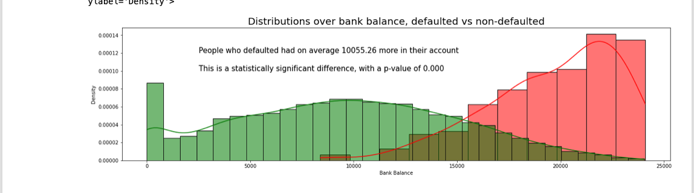
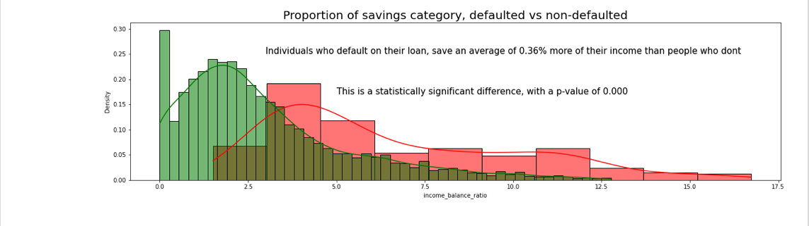
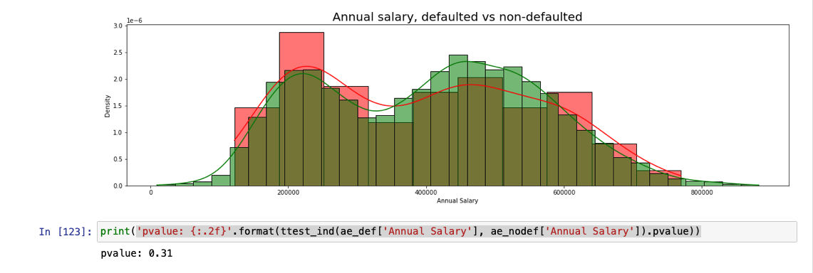
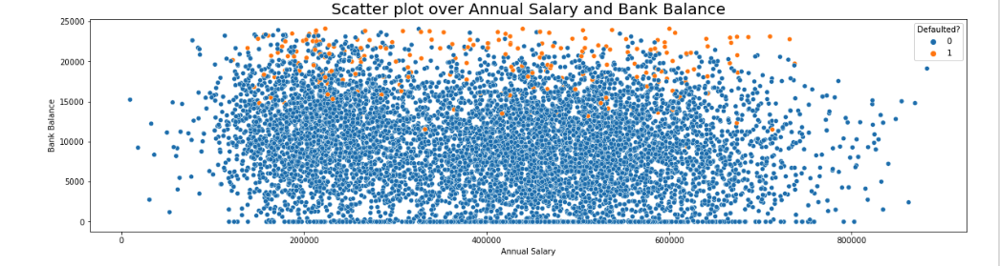

# Predicting defaults on loans
The purpose of this project is to predict whether or not a loan applicant will defualt on their loan. It will output this both in a "yes or no" fashion, as well as a percentage chance. Hopefully this will help a bank screen applicants in a more efficient manner.

## Results

## Data
The dataset i'll be using is the "Loan Default Prediction" dataset from Kamal Das, uploaded to Kaggle.com
https://www.kaggle.com/kmldas/loan-default-prediction

## Key overview of each step
### Big picture decisions
#### Problem
Predicting whether or not an applicant will default on their loan
#### General model
Firstly, since we're working with labeled data, we will use a supervised model. Also since this is a dichotoumous outcome (yes or no), a logistic regression will be used as a baseline. Other models might be included to compare performances. Lastly, because our dataset is relatively manageable and we dont need to adjust to changes rapidly, we'll be using a plain old batch learning approach.
#### Performance measure
Performance measure will be the *accuracy* (percent/proportion of cases classified correctly) as well as *sensitivity* (The percent or proportion of 1s correctly classified, in this case the amount of correctly predicted defaults).
### Data cleaning
Whilst there wasn't a whole lot of data cleaning, i'll list the data modifications below.
* Created income_balance_ratio variable that measures the difference between annual salary and bank balance
* Split the data early on to avoid implicit bias from the data exploration
### Exploratory data analysis
#### Main take-aways from EDA
Higher bank balance and a higher percentage of annual salary saved both counterintuitively leads to higher rates of defaulting, this is likely due to mislabeling (see below). Employmeant seems to play a role in preventing defaulting, and annual salary does not have a statistically significant impact on defaulting. The EDA leads me to test both with and without including Annual Salary in the modelbuilding process.

#### About the data itself
The data consists of 10000 individuals with a few financial indicators on each. We get the following information: Employment, bank balance, annual salary, whether and wether or not a person has defaulted. From bank balance and annual income i created the income_ratio_balance variable as discussed above. About 3.34% of all individuals ended up defaulting on their loans. The average annual salary was 402204, and the average bank balance was 10025. 

#### The counter-intuitive relationship between bank balance and defaulting
Going into this EDA i definetly expected that individuals with a high balance in their bank-accounts, were less likely to default on their loans. However, this assumption was quickly disproven however.

As we see from the graph people who defaulted had a WAY higher bank balance on average. This leads me to the conclusion that bank balance is likely wrongly coded, and might refer to outstanding liabilities or something similar instead of bank balance. Although i checked kaggle, this was not explained anywhere. Since this is most likely due to wrong labeling, we should still be able to continue with that in mind.

#### The counter-intuitive relationship between income_balance_ratio and defaulting
As a result of the wrong labeling of bank balance, we also end up with a weird relationship on income_balance_ratio. Initially this variable was created to represent what percentages of an individuals annual income, that individual had in their bank account. Basically it was supposed to measure the "saving tendency" of an individual. The variable produced the following result:

This graph suggests that a higher percentage of income "saved" leads to a higher likelihood of defaulting... which doesn't make sense. Luckily this can be explained by the mislabelling of bank balance. If bank balance instead measures "liabilities" or something similar, the income_balance_ratio would instead measure ex. annual debt as a percentage of annual salary. Here it would definetly make intuitive sense that more debt in comparison to income would lead to a higher likelihood of defaulting.

#### Shortly about annual salary
Something else i was quite surprised about was the relationships with annual salaries. Through an initial correlation matrix it seemed like a higher annual salary did indeed lead to lower chances of defaulting, however on closer inspection that didn't hold up:

This graph (with calculations) indicate that it might not be worth the noise to include annual salary in our models. This indication is only made stronger, when we examine the relationship with bank-balance:

In short, annual salary doesn't seem to be nearly as important as i would've expected, and therefore it's worth experimenting a bit with it.

#### A little bit about employment
Employment in short: Unemployed people are responsible for 36.13% of all defaults, despite making up only 17.43% of the dataset. However that being said, its still only 4.45% of unemployed people who default compared to 3.18 of employed individuals.
### Modelbuilding 
### Productionization

## Problems and fixes
1. Trouble fitting multiple seaborn plots into matplotlib subplots, solution found at:
https://dev.to/thalesbruno/subplotting-with-matplotlib-and-seaborn-5ei8

2. Trouble creating a new variable column, that creates a ratio between income and bank balance. Solution found at: 
https://stackoverflow.com/questions/38032817/dividing-one-dataframe-column-by-another-division-by-zero/46942969

3. Ran into problems limiting decimal places when creating income_balance_ratio predictor. Solution found at:
https://stackoverflow.com/questions/54509060/limiting-the-number-of-decimal-places-in-python-pandas-table

4. Why i chose to recode high income_balance_ratios
https://www.tiaa.org/public/learn/personal-finance-101/how-much-of-my-income-should-i-save-every-month

5. A larger than i would admit amount of time was spent creating the distribution over income_balance_ratio between defaulted and non-defaulted individuals. The solution ended up being the "stat" argument from seaborns documentation. Can be found at:
https://seaborn.pydata.org/tutorial/distributions.html

